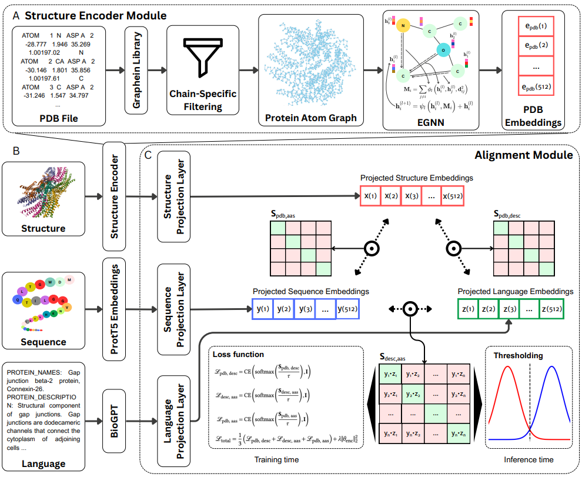

### To do list in the repository (will be deleted once completed)

[ ] Fill in missing links in the data prep docs
[ ] Write download script
[ ] Finish readme 
[ ] Make sure env set up is seamless
[ ] Test all code on MacOS
[ ] Get external lab member to review code and docs


----
----
----

# CLASP: Contrastive Learning of Amino acid, Structure, and Protein description

**CLASP** is a tri-modal contrastive learning framework for unified representation of protein structure, sequence, and description. It enables downstream applications such as cross-modal retrieval, similarity scoring, and zero-shot classification by learning a shared embedding space across all three modalities.

---

## Table of contents
1. [Overview of the CLASP framework](#overview-of-the-clasp-framework) 
2. [Repository structure](#repository-structure)
3. [Environment setup](#environment-setup)
4. [Documentation and usage](#documentation-and-usage)
5. [Citation](#citation)

---
## Overview of the CLASP framework

<p align="center">
  
</p>


---

## Repository structure

```
CLASP/
├── src/                   # Core source code
├── data/                  # Example data files and mappings
├── final_models/          # Trained checkpoints
├── docs/                  # Documentation
│   ├── data_preparation.md
│   ├── train_clasp.md
│   ├── inference_utilities.md
│   └── assets/clasp_pipeline.png
├── requirements.txt
└── README.md
```

---

## Environment setup

TBD

---

## Documentation and usage

| File                                                    | Description                                    |
| ------------------------------------------------------- | ---------------------------------------------- |
| [`data_preparation.md`](docs/data_preparation.md)       | Instructions for obtaining and formatting data |
| [`train_clasp.md`](docs/train_clasp.md)                 | Training setup and script usage                |
| [`inference_utilities.md`](docs/inference_utilities.md) | Inference and retrieval utilities              |

---

## Citation

TBD

